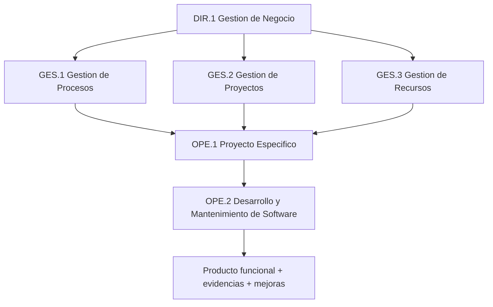
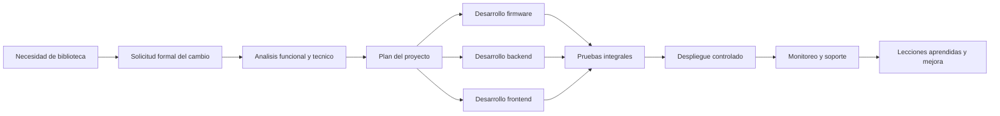

# MoProSoft y ejemplo de implementacion en SIA

## 1. Objetivo del documento

Este documento resume el modelo MoProSoft y muestra un ejemplo de implementacion aplicado al proyecto `SIA`, tomando como caso practico un subproyecto real del repositorio: la integracion del escaner de biblioteca con `M5 Atom`, `Cloud Functions`, servicios web y modulo administrativo.

La intencion no es solo describir la teoria, sino mostrar como un modelo de procesos puede ayudar a organizar mejor el desarrollo, mantenimiento, control de cambios, calidad y seguimiento del sistema.

---

## 2. Que es MoProSoft

MoProSoft significa `Modelo de Procesos para la Industria del Software`. Fue creado en Mexico para ayudar a organizaciones pequenas y medianas, o equipos internos de desarrollo, a trabajar con procesos definidos sin caer en modelos demasiado pesados o costosos.

Su enfoque principal es:

- ordenar la gestion del negocio, de los proyectos y de los recursos
- estandarizar la forma de desarrollar y mantener software
- facilitar la medicion y mejora continua
- servir como base para evaluacion y adopcion de buenas practicas

MoProSoft fue llevado a la norma mexicana `NMX-I-059-NYCE` y su experiencia tambien sirvio como base relevante para la familia `ISO/IEC 29110`, orientada a organizaciones pequenas o Very Small Entities.

### Beneficios principales

| Beneficio | Impacto esperado en un proyecto como SIA |
|---|---|
| Estandarizacion | Reduce trabajo improvisado entre frontend, backend y firmware |
| Trazabilidad | Permite relacionar requerimientos, cambios, pruebas y entregas |
| Control | Ayuda a planear tiempos, responsables, riesgos y evidencias |
| Calidad | Favorece revisiones, pruebas y seguimiento de incidencias |
| Mejora continua | Hace visible que procesos funcionan y cuales deben ajustarse |

---

## 3. Estructura de MoProSoft

MoProSoft organiza sus procesos en tres categorias.

| Categoria | Proceso | Proposito general |
|---|---|---|
| Alta Direccion | `DIR.1 Gestion de Negocio` | Alinear el desarrollo de software con objetivos institucionales |
| Gerencia | `GES.1 Gestion de Procesos` | Definir, mantener y mejorar los procesos de trabajo |
| Gerencia | `GES.2 Gestion de Proyectos` | Planear, dar seguimiento y controlar proyectos |
| Gerencia | `GES.3 Gestion de Recursos` | Administrar personas, infraestructura, conocimiento y ambiente de trabajo |
| Operacion | `OPE.1 Administracion de Proyectos Especificos` | Ejecutar un proyecto concreto con alcance, tiempo y costo definidos |
| Operacion | `OPE.2 Desarrollo y Mantenimiento de Software` | Analisis, diseno, construccion, integracion, pruebas y mantenimiento |

### Relacion entre categorias y procesos



### Niveles de capacidad

En la literatura de MoProSoft y su relacion con `ISO/IEC 15504`, los procesos pueden crecer por niveles de capacidad:

| Nivel | Nombre | Significado practico |
|---|---|---|
| 1 | Realizado | El proceso produce resultados esperados |
| 2 | Gestionado | El proceso ya se planea, monitorea y controla |
| 3 | Establecido | El proceso esta definido y se usa de forma consistente |
| 4 | Predecible | El proceso se mide y opera dentro de limites controlados |
| 5 | Optimizado | El proceso mejora continuamente con base en datos |

Para `SIA`, una meta realista inicial seria trabajar entre nivel 1 y nivel 2 en los procesos mas importantes.

---

## 4. Lectura de SIA desde MoProSoft

Con base en `.agents/project-map.md`, `SIA` ya tiene una estructura tecnica amplia:

- frontend web en `public/`
- backend en `functions/`
- reglas y configuracion Firebase en la raiz
- firmware para hardware especifico en `firmware/`
- documentacion de apoyo en `.agents/`

Eso significa que `SIA` no es solo una app web; es un sistema mixto con componentes de interfaz, servicios, nube, datos y dispositivos.

### Mapeo de MoProSoft al proyecto

| Proceso MoProSoft | Evidencia actual en SIA | Oportunidad de mejora |
|---|---|---|
| `DIR.1 Gestion de Negocio` | Existe una plataforma institucional con modulos claros: aula, biblioteca, medico, foro, comunidad, cafeteria, avisos | Formalizar objetivos de negocio por modulo, prioridades trimestrales y KPIs |
| `GES.1 Gestion de Procesos` | Hay mapa del proyecto en `.agents/project-map.md` y planes de apoyo | Convertir esto en un proceso oficial de trabajo: solicitud, analisis, desarrollo, pruebas, liberacion y retroalimentacion |
| `GES.2 Gestion de Proyectos` | Existen planes y trabajo modular por iniciativas | Estandarizar cronograma, riesgos, responsables, entregables y cambios aprobados |
| `GES.3 Gestion de Recursos` | El repositorio integra `Firebase`, `Cloud Functions`, PWA y firmware M5 Atom | Documentar roles, conocimiento tecnico, accesos, secretos, ambientes y dependencias |
| `OPE.1 Administracion de Proyectos Especificos` | Cada modulo o mejora puede tratarse como proyecto puntual | Crear acta breve, alcance, criterios de aceptacion, riesgos y cierre |
| `OPE.2 Desarrollo y Mantenimiento de Software` | El desarrollo real ya existe en `public/`, `functions/` y `firmware/` | Agregar trazabilidad entre requerimiento, cambio en codigo, prueba y despliegue |

### Interpretacion general

`SIA` ya tiene la base tecnica para trabajar con MoProSoft, pero todavia puede ganar mucho si formaliza el proceso alrededor del codigo. En otras palabras: el reto principal no es tecnico, sino de gestion y control del trabajo.

---

## 5. Ejemplo de implementacion en SIA

### Caso propuesto

`Implementacion y operacion del flujo de escaneo para Biblioteca`

Este caso es adecuado porque el repositorio ya contiene piezas reales del flujo:

- firmware en `firmware/m5atom-biblio-scanner/`
- ingest de eventos en `functions/scanner.js`
- escucha de estaciones en `public/services/scanner-service.js`
- integracion administrativa en `public/modules/admin-biblio/reportes.js`

### 5.1 Objetivo del proyecto especifico

Implementar un flujo confiable para registrar visitas, prestamos y devoluciones en biblioteca mediante escaneo QR, reduciendo captura manual, errores de operacion y tiempos de atencion.

### 5.2 Aplicacion de MoProSoft al caso

| Proceso | Aplicacion concreta en SIA |
|---|---|
| `DIR.1 Gestion de Negocio` | Definir por que el escaner aporta valor: menor tiempo de atencion, menos errores y mejor trazabilidad de uso de biblioteca |
| `GES.1 Gestion de Procesos` | Establecer el flujo oficial: solicitud -> analisis -> desarrollo -> pruebas -> despliegue -> soporte |
| `GES.2 Gestion de Proyectos` | Planear alcance, fechas, responsables, riesgos y criterios de aceptacion del subproyecto |
| `GES.3 Gestion de Recursos` | Asignar desarrollador frontend, backend/Firebase, responsable de firmware, QA y personal de biblioteca |
| `OPE.1 Administracion de Proyectos Especificos` | Llevar seguimiento del subproyecto del escaner con entregables y control de cambios |
| `OPE.2 Desarrollo y Mantenimiento de Software` | Construir, probar y corregir firmware, backend y UI del flujo de escaneo |

### 5.3 Flujo operativo propuesto



### 5.4 Roles sugeridos

| Rol | Responsabilidad en el ejemplo |
|---|---|
| Patrocinador institucional | Autoriza prioridad y valida valor del cambio |
| Lider del proyecto SIA | Coordina alcance, tiempos, riesgos y seguimiento |
| Desarrollador frontend | Integra modales, estados y validaciones en biblioteca |
| Desarrollador backend | Mantiene `functions/scanner.js` y servicios Firebase |
| Responsable de firmware | Configura y prueba `m5atom-biblio-scanner` |
| QA o soporte | Ejecuta pruebas de flujo, errores y regresiones |
| Responsable de biblioteca | Valida usabilidad, tiempos y reglas operativas |

### 5.5 Artefactos minimos del proyecto

| Artefacto | Contenido minimo | Ejemplo en SIA |
|---|---|---|
| Acta del proyecto | objetivo, alcance, responsables, fecha | "Integrar scanner para visitas y prestamos" |
| Lista de requisitos | entradas, salidas, reglas de negocio | reconocer QR de alumno, libro y modo de operacion |
| Plan del proyecto | tareas, fechas, riesgos, criterios de aceptacion | desarrollo por capas: firmware, ingest, UI admin |
| Bitacora de cambios | solicitudes, motivo, impacto, aprobacion | cambio en normalizacion de `mode`, nuevas validaciones |
| Evidencia de pruebas | casos probados y resultados | visita exitosa, prestamo con doble escaneo, error sin WiFi |
| Cierre y lecciones | que funciono, que fallo, mejoras siguientes | necesidad de mejor monitoreo y pruebas de conectividad |

### 5.6 Cuadro de trazabilidad

| Requisito | Componente del repo | Evidencia esperada |
|---|---|---|
| Registrar un escaneo desde el dispositivo | `firmware/m5atom-biblio-scanner/` | lectura correcta y envio HTTPS |
| Recibir y normalizar el evento | `functions/scanner.js` | documento actualizado en `scanner-stations` |
| Interpretar el escaneo en la app | `public/services/scanner-service.js` | identificador extraido correctamente |
| Ejecutar flujo de visita/prestamo/devolucion | `public/modules/admin-biblio/reportes.js` | modal correcto, consulta correcta y mensajes de estado |

### 5.7 Riesgos y tratamiento

| Riesgo | Impacto | Accion preventiva |
|---|---|---|
| Fallas de conectividad WiFi | El escaneo no llega al sistema | prueba previa de red, reintentos y estado visual del dispositivo |
| QR con formato inconsistente | El sistema no identifica usuario o libro | reglas de normalizacion y catalogo de formatos validos |
| Cambios sin documentacion | Se rompe el flujo entre firmware, backend y UI | control de cambios y bitacora tecnica |
| Dependencia de una sola persona | Se pierde conocimiento operativo | documentar configuracion, roles y procedimiento de soporte |
| Regresiones en biblioteca | Fallos en prestamos o devoluciones | pruebas de humo antes de liberar |

---

## 6. Indicadores sugeridos para SIA

Si `SIA` adopta MoProSoft, no basta con documentar procesos; tambien debe medirlos.

| Indicador | Formula basica | Meta sugerida |
|---|---|---|
| Cumplimiento de entregas | entregables completos / entregables planeados | >= 90% |
| Incidencias post-liberacion | incidentes detectados tras despliegue / version | tendencia a la baja |
| Trazabilidad de cambios | cambios con requerimiento y evidencia / total de cambios | 100% |
| Exito de escaneo | escaneos procesados correctamente / escaneos totales | >= 95% |
| Tiempo de atencion en biblioteca | minutos por operacion antes vs despues | reduccion visible |

### Grafica conceptual de mejora esperada

```text
Situacion inicial:
Planeacion      [###.......]
Trazabilidad    [##........]
Pruebas         [###.......]
Seguimiento     [##........]

Con MoProSoft:
Planeacion      [########..]
Trazabilidad    [########..]
Pruebas         [#######...]
Seguimiento     [########..]
```

---

## 7. Propuesta de adopcion gradual en SIA

Una adopcion realista para `SIA` puede hacerse en cuatro fases.

| Fase | Duracion estimada | Resultado |
|---|---|---|
| 1. Diagnostico | 1 semana | identificar como se trabaja hoy y que falta formalizar |
| 2. Estandarizacion minima | 2 semanas | definir plantillas de proyecto, cambios, pruebas y cierre |
| 3. Piloto | 2 a 4 semanas | aplicar el modelo a un caso real, por ejemplo biblioteca scanner |
| 4. Escalamiento | continuo | extender el proceso a otros modulos como `foro`, `medi` o `comunidad` |

### Recomendacion practica

El mejor punto de entrada para `SIA` no es intentar implantar todo MoProSoft de una vez. Lo mas recomendable es:

1. formalizar `OPE.1` y `OPE.2` en un subproyecto real
2. despues consolidar `GES.2` y `GES.1`
3. finalmente conectar eso con indicadores y decisiones de `DIR.1`

---

## 8. Conclusion

MoProSoft es un modelo util para `SIA` porque ayuda a convertir un esfuerzo tecnico grande y modular en un sistema de trabajo mas controlado, medible y repetible. El proyecto ya cuenta con evidencia de madurez tecnica en frontend, backend, nube y firmware; lo que falta es ordenar mejor la gestion alrededor de ese trabajo.

El ejemplo del escaner de biblioteca muestra que MoProSoft si puede aplicarse en este repositorio de forma concreta. No se trataria de agregar burocracia, sino de dejar claro:

- que se va a construir
- quien lo aprueba
- quien lo desarrolla
- como se prueba
- como se libera
- como se mejora despues

Si `SIA` adopta esta logica por modulo o por iniciativa, puede mejorar calidad, continuidad operativa y capacidad de crecimiento sin perder velocidad de desarrollo.

---

## 9. Fuentes consultadas

- UNAM - Estandar Internacional ISO/IEC 29110: https://kualikaans.fciencias.unam.mx/index.php/proyectos/estandar-internacional-iso-iec-29110
- ISO - `ISO/IEC 29110-2-1:2015`: https://www.iso.org/standard/62712.html
- CLEI Electronic Journal - `From MoProSoft Level 2 to ISO/IEC 29110 Basic Profile: Bridging the Gap`: https://clei.org/cleiej/index.php/cleiej/article/view/131
- UNAM / Enterate - resumen de procesos de MoProSoft: https://www.paginaspersonales.unam.mx/files/69/Publica_20110622215407.pdf
- Repositorio UABC - tesis sobre implantacion de MoProSoft y niveles de capacidad: https://repositorioinstitucional.uabc.mx/bitstreams/874a795a-b946-4767-a96d-927165189797/download
