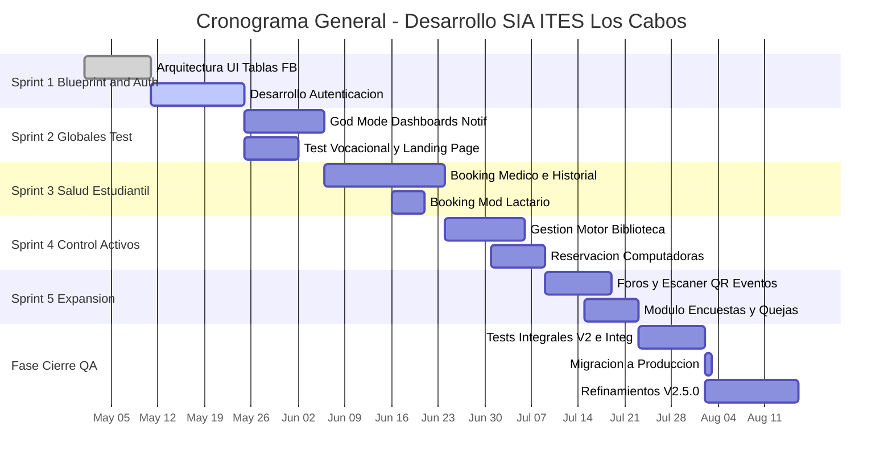

# Proyecto SIA: Sistema de Integración Académico

## 1. Caso de Negocio
El Instituto Tecnológico de Estudios Superiores de Los Cabos (ITES Los Cabos) cuenta con múltiples áreas de atención a estudiantes, tales como Biblioteca, Departamento de Psicología, Servicios Médicos, Foros/Eventos y Aulas. Sin embargo, estas áreas operan actualmente de manera fragmentada o con procesos predominantemente manuales, lo que genera cuellos de botella, pérdida de información, y una experiencia fragmentada para los estudiantes y los administradores institucionales. 

El proyecto **SIA (Sistema de Integración Académico)** surge como una solución integral para digitalizar, centralizar y automatizar los servicios estudiantiles y administrativos. El sistema permitirá gestionar digitalmente el acervo bibliográfico y el préstamo de equipos, agendar citas médicas y psicológicas (con expediente clínico electrónico), aplicar encuestas institucionales (ej. test vocacional), gestionar espacios para lactancia, registrar quejas y canalizar avisos globales para toda la comunidad académica. La implementación de SIA optimizará los tiempos de respuesta del personal, brindará a los estudiantes un canal web unificado (PWA optimizada mobile-first) y ofrecerá inteligencia de datos para la toma de decisiones directiva.

## 2. Visión del Proyecto
Crear una plataforma digital centralizada, robusta y escalable para ITES Los Cabos que modernice e integre los servicios no académicos (médicos, psicológicos, biblioteca, foros) y académicos (aula, tutorías, vocacional) en un único ecosistema web. De acuerdo a este esquema, SIA empoderará a los estudiantes con acceso ubicuo e intuitivo a sus beneficios estudiantiles, y proveerá a los departamentos administrativos de herramientas administrativas asíncronas para su gestión diaria efectiva.

## 3. Involucrados del Proyecto (Stakeholders)
- **Estudiantes y Aspirantes:** Usuarios objetivos primarios del sistema; mediante la aplicación agendan citas médicas/psicológicas, consultan/reservan recursos de biblioteca, realizan el test vocacional y consultan el estatus de sus solicitudes así como avisos institucionales.
- **Personal Médico y Psicológico:** Utilizan el módulo administrativo de *Servicios Médicos* para gestionar agendas, consultas en espera, realizar intervenciones documentadas y mantener el archivo o historial clínico electrónico de los estudiantes de manera encriptada y resguardarla.
- **Personal de Biblioteca:** Operan la parte encargada de rastrear libros físicos prestados y consultados de forma local, además gestionar el flujo de usuarios que utilizan en préstamo las computadoras de recinto.
- **Docentes y Encargados de Aula/Foro:** Encargados en requerir la gestión de auditorios, foros, laboratorios y pase de lista automatizada por identificadores integrados con el carnet digital generado de los usuarios.
- **Administradores y Superadministradores de TI:** Dueños técnicos o el *Squad de Mantenimiento Institucional.* Tienen una vista superior de todas las transacciones ("Panel God Mode") en las métricas de usuarios, facultades de encender/apagar servicios instantáneamente y despliegue de notificaciones críticas.
- **Directores / Coordinadores ITS:** Patrocinadores o *Sponsors* institucionales, son beneficiarios de métricas abstractas del estado general del campus.

## 4. Product Backlog (Pila de Producto)
A continuación, las grandes épicas o requerimientos priorizados que el equipo persigue para consolidar el caso de uso base de la aplicación.

| ID | Módulo | Historia de Usuario | Prioridad |
|:---|:---|:---|:---|
| PB-01 | Autenticación | Como usuario (estudiante/staff), quiero iniciar sesión con mi correo institucional para visualizar la interfaz específica de mis permisos de acceso. | Alta |
| PB-02 | Vocacional | Como prospecto estudiantil, quiero contestar un Test Vocacional para recibir con inmediatez un reporte del programa de licenciatura más afín. | Alta |
| PB-03 | Core / Admin | Como control escolar/staff, requiero emitir alertas críticas a todos los dispositivos (mantenimiento y emergencias) para prevenir la sobrecarga o guiar al estudiante. | Alta |
| PB-04 | Módulo Medi | Como estudiante, requiero enviar una solicitud de apartar mi cita presencial en base a la línea temporal disponible del área de la salud. | Alta |
| PB-05 | Módulo Medi | Como doctor/psicólogo, requiero desplegar la secuencia interactiva de mi sala de espera para despachar consultas que devuelvan el historial clínico pre-existente. | Alta |
| PB-06 | Módulo Biblio | Como estudiante, quiero explorar el repositorio local de libros o la pasarela a eLibro y la posibilidad de reservar una estación de computadora desde mi celular. | Media |
| PB-07 | Módulo Biblio | Como bibliotecario, quiero cambiar y observar en tiempo real los estados del hardware en préstamo u horas expiradas. | Media |
| PB-08 | Encuestas | Como unidad de calidad ITS, quiero configurar cuestionarios abiertos para levantar índices de retención (quejas) o satisfacción sin necesidad de programar de cero. | Media |
| PB-09 | Módulo Lactario | Como estudiante en lactancia, preciso un mecanismo simplificado y discreto que me reserve la franja horaria requerida en esa cabina privada. | Baja |
| PB-10 | Módulo Foro | Como ponente, precisó de validación rápida de entrada tipo FastTrack durante el inicio de eventos (código QR / NFC). | Baja |

## 5. Estimación mediante Puntos (Story Points)
La agilidad asume una estimación basada en la sucesión de *Fibonacci* enfocada a la complejidad lógica, grado en el cruce de tablas dentro la BD NoSQL y el nivel en diseño UI contemplado. Escala de 1 al 13 Pts.

| ID | Módulo | Historia de Usuario | Story Points | Justificación |
|:---|:---|:---|:---|:---|
| PB-01 | Autenticación | Sistema Base de Usuarios | 8 pts | Requiere arquitectura robusta para control de acceso (Firebase Auth) y sincronización con perfiles en base de datos. Complejidad en redirecciones y validación de dominios de correos oficiales. |
| PB-02 | Vocacional | Test dinámico de Aptitudes | 5 pts | Moderado. Contempla una Landing Page propia que consuma reglas de test (BancoPreguntas o Excel) e incluya reporte interactivo visual al usuario. |
| PB-03 | Core / Admin | Central Monitor (Superadmin) | 13 pts | Alta complejidad al tener el "Super Switch" para los enrutamientos y visualización de auditoría, lectura en masa de métricas gráficas generalizada. |
| PB-04 | Módulo Medi | Citas Reservación Alumnos | 5 pts | Validar las colas de horas, requiere manejar fechas en timestamps sin colisiones y feedback instantáneo si un turno fue tomado un segundo antes. |
| PB-05 | Módulo Medi | Flujo Doc/Psic Sala e Historial | 13 pts | Elevada, integra operaciones CRUD pesadas (datos y receta) junto al manejo seguro/encriptado que debe poseer un expediente médico o psiquiátrico bajo normas de la salud institucional. |
| PB-06 | Módulo Biblio | Front Biblioteca del estudiante | 8 pts | Las colecciones de libros a buscar son muy grades, se requiere crear un motor proxy para indexado, lazy-load y filtros precisos de búsqueda. |
| PB-07 | Módulo Biblio | Panel Backoffice y PCs | 8 pts | Manipulación concurrente de estaciones y alertas visuales. Temporizadores que reaccionen a la hora del servidor con limpieza de campos en los tiempos muertos. |
| PB-08 | Encuestas | Motor de cuestionarios dinámicos | 5 pts | Creación de forms mediante variables genéricas. Guarda sus nodos correspondientes en colección. |
| PB-09 | Módulo Lactario | Booking de espacios físicos | 3 pts | Es el equivalente minimalista y simplificado a la tabla Medi de doctores, su UI demanda ser mucho más ágil de una sola pantalla. |
| PB-10 | Módulo Foro | QR Scanner de asistentes | 8 pts | Involucra conectarse con la API de MediaDevices (cámaras de celulares), procesamiento gráfico de imagen constante para extraer la info de ticket de matrícula del asistente. |
| **Total Estimativo:** | | | **76 Puntos**| |

## 6. Cronograma General del Proyecto

Generación lógica ilustrativa que denota superposiciones por Sprints o releases escalonados orientados a valor, considerando el tamaño de un cuatrimestre para arrancar un sistema mínimo viable.

